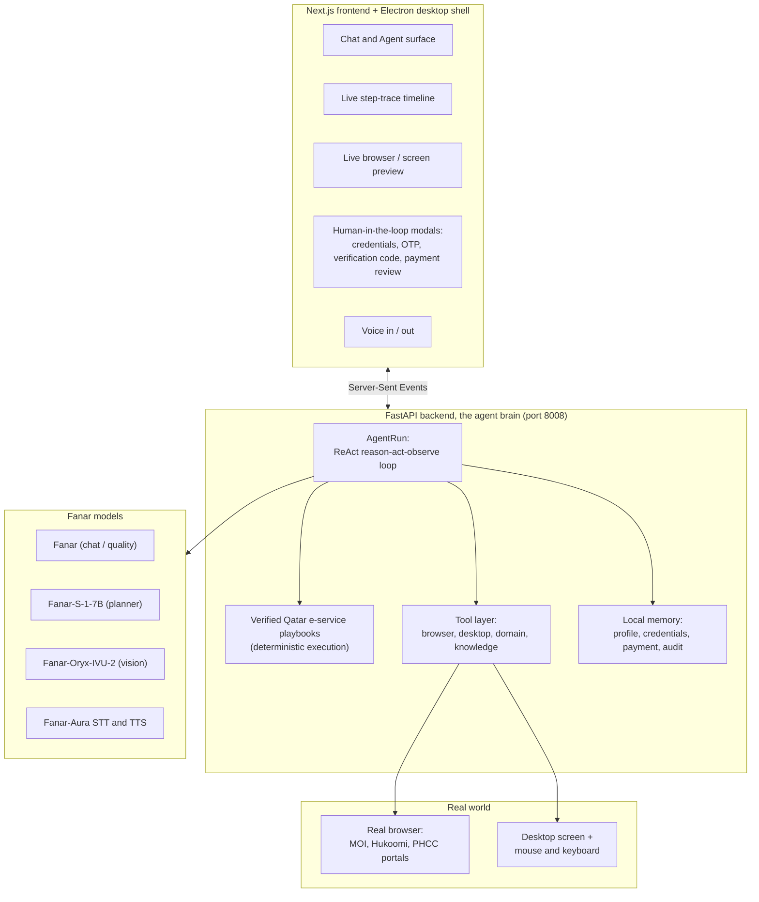
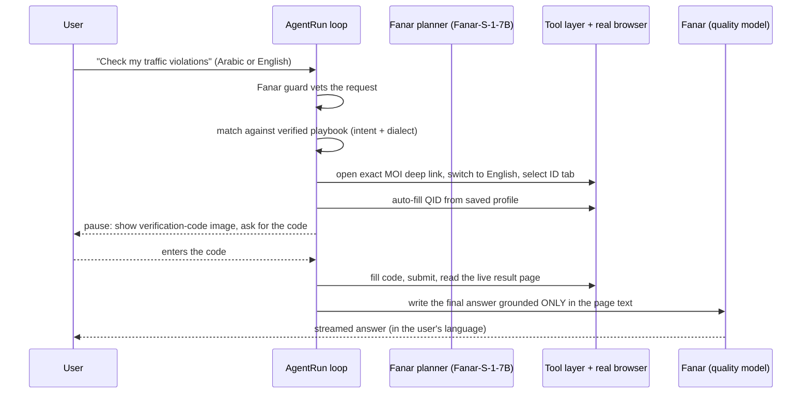

# MERAB Agent

### A Fanar-powered agentic assistant that completes Qatar e-services for you, in Arabic and English

> Building Agentic AI Solutions for Societal Impact · Fanar Hackathon 2026
> Track 1 (Smart Government & Citizen Services), extended into Healthcare and Education.

MERAB Agent is not a chatbot. It is an autonomous agent that understands what a resident of Qatar needs (in Modern Standard Arabic, Gulf dialect, or English), finds the correct official service, and then actually does the task end to end inside a real browser: it navigates the portal, fills the forms, reads the result, and reports back, pausing for your approval at every sensitive step. The same agent also fetches medications and latest lab results.

Fanar is the brain at every layer: planning, language understanding, Arabic generation, vision, speech, safety, and localization.

---

## Table of contents

1. [The problem](#1-the-problem)
2. [What MERAB Agent does](#2-what-merab-agent-does)
3. [Try it: example tasks](#3-try-it-example-tasks)
4. [Solution architecture](#4-solution-architecture)
5. [Agentic workflow design](#5-agentic-workflow-design)
6. [How Fanar powers MERAB Agent](#6-how-fanar-powers-merab-agent)
7. [External tools and technologies](#7-external-tools-and-technologies)
8. [Project structure](#8-project-structure)
9. [Getting started](#9-getting-started)
10. [Privacy and safety](#10-privacy-and-safety)
11. [Evaluation and insights](#11-evaluation-and-insights)
12. [Recommendations for future Fanar](#12-recommendations-for-future-fanar)
13. [Honest limitations and roadmap](#13-honest-limitations-and-roadmap)

---

## 1. The problem

Government, healthcare, and education services in Qatar are increasingly digital, but for many residents they are still hard to use:

* **Services are fragmented across many portals.** Traffic fines live on one MOI site, residency and document inquiries on another, authenticated services (National Address, ID card replacement) on the Tawtheeq-secured E-Services portal, and health records on the PHCC patient portal. A resident has to know which portal does what.
* **The interfaces are bilingual and form-heavy.** Switching the page to English, picking the right search tab, entering a QID in the right field, handling date pickers, reading a verification code, and completing a payment is a lot of friction, especially for elderly residents, new expats, or anyone who is not comfortable in both Arabic and English.
* **Existing AI assistants only talk; they do not act.** A question-answering chatbot can tell you the documents you need for a family visit visa, but it cannot open the portal, sign you in, check your actual traffic violations, or email you your National Address certificate.

**MERAB Agent closes that gap.** It combines Fanar's Arabic-first language, vision, and speech capabilities with a real browser and a curated knowledge base of verified Qatar e-service playbooks, so a resident can simply say what they want, in their own language, and the agent carries it out, keeping the human in control of logins, one-time codes, verification codes, and payments.

**Who benefits:** every resident of Qatar, with particular impact for non-Arabic speakers, non-English speakers, the elderly, people with low digital literacy, and anyone who finds government paperwork intimidating. The same agentic foundation extends naturally to patient support and education, the other two hackathon tracks.

---

## 2. What MERAB Agent does

One unified agent spans three domains. It decides, per request, whether to answer from knowledge, drive the browser for live or account-specific data, or run a domain tool.

### Smart Government and citizen services
* Answers service questions from Fanar's knowledge first (documents, fees, requirements, how a process works).
* Checks live, account-specific data on official portals: traffic violations, residency-permit eligibility, official-document expiry dates.
* Completes authenticated tasks on the MOI E-Services portal: update National Address, request a National Address certificate (emailed to you), and replace a lost or damaged ID card, including the fee payment, with your confirmation.
* Reads PHCC patient-portal records: medications, vitals and latest results, documents, appointments, and secure messaging.
* Drafts official letters (for example a salary-certificate request) and saves them as artefacts.

### Healthcare information and patient support
* Summarizes a clinical note into structured sections (Chief Complaint, History, Findings, Assessment, Plan).
* Explains a medication (uses, common considerations, side effects, cautions), without giving an individualized dose.
* Writes clear, patient-friendly home-care instructions, in Arabic by default.
* Gives cautious symptom triage with an urgency level and red-flag warnings.
* Every health output carries a safety disclaimer and an emergency-number reminder (999 in Qatar). The agent informs; it never diagnoses.

### Education and cultural preservation
* Builds structured lesson plans, multiple-choice quizzes with answer keys, and front-and-back flashcards.
* Explains concepts simply with an analogy and a check-for-understanding question.
* Tutors in Arabic and English and celebrates Arabic language and heritage. Generated materials are saved to a workspace.
* Helps apply to different universities.

### Across all three domains
* **Bilingual, dialect-aware.** Speak or type in Arabic (including Gulf dialect) or English. The agent answers in your language and writes Arabic natively.
* **Voice in and out.** Speak a command (Fanar speech to text) and optionally hear the reply (Fanar text to speech).
* **Watch it work.** A live preview shows the real browser or desktop screen, and a step-by-step trace timeline shows every thought, action, and observation.
* **You stay in control.** The agent pauses and hands control back to you for sign-in, one-time codes, verification codes, and before any payment or other irreversible step.

---

## 3. Try it: example tasks

These are real prompts the agent is built to handle (they ship as in-app quick actions):

```
What documents do I need for a family visit visa in Qatar?
Check my traffic violations
تحقق من حالة تأشيرتي
Guide me through how to renew my residency permit
Send my National Address certificate to my email
Replace my lost ID card
Explain Metformin and write Arabic patient instructions for hypertension
Make a 5-question quiz on Qatari history and save it
```

The agent decides on its own whether each request is a knowledge question, a live browser task, or a domain tool, and acts accordingly.

---

## 4. Solution architecture

MERAB Agent is a three-process stack with Fanar at its core.



**1. Backend (the agent brain), FastAPI on port 8008.**
A streaming API (`/api/*`) that runs the agentic loop and emits every step as Server-Sent Events. Key endpoints: `/api/agent` (the agentic loop), `/api/agent/resume`, `/api/agent/credentials`, `/api/agent/inputs`, `/api/agent/captcha`, `/api/agent/otp` (the human-in-the-loop continuations), `/api/chat` (plain streaming chat), `/api/voice/transcribe` and `/api/voice/speak` (Fanar speech), plus profile, payment, credentials, history, and workspace endpoints.

**2. Frontend, Next.js 14 (App Router) on port 3000.**
A single-page app with two modes: Chat (multi-turn Q&A) and Agent (one autonomous task per conversation). It renders the streamed trace, a live preview of the browser or screen, voice controls, a Saved Information drawer (profile, payment card, saved logins), a History panel that replays past runs step by step, and purpose-built human-in-the-loop modals. The UI is fully English and Arabic with real right-to-left layout. The design system is dependency-light: a custom inline SVG icon set, a custom Markdown renderer (no `dangerouslySetInnerHTML`, so no cross-site-scripting surface), and CSS animations.

**3. Desktop shell, Electron.**
The same Next.js UI loaded in a frameless desktop window with a global summon hotkey (Ctrl+Shift+F) and a system tray. When the agent runs inside the desktop shell, it unlocks a second "surface": computer use. It can see the screen with Fanar vision and control the mouse and keyboard, with every risky action gated behind your explicit approval.

The backend is the source of truth; the frontend and desktop shell are two views onto the same agent.

---

## 5. Agentic workflow design

This is the heart of the project. MERAB Agent is a genuine agent, not a prompt wrapper. It demonstrates multi-step planning and reasoning, task decomposition, tool orchestration, memory and state, retrieval, and autonomous workflow execution with human checkpoints.

### 5.1 A ReAct loop on top of a model with no native tool calling

Fanar is OpenAI-API compatible but does not expose native function calling. So the agent implements a robust ReAct-style JSON protocol. On every turn the model must reply with exactly one JSON object, either a tool call or a final answer:

```json
{ "thought": "open the official inquiry page", "action": "open_page",
  "action_input": { "url": "https://fees2.moi.gov.qa/moipay/inquiry/violation" } }
```

The loop parses that object (tolerating code fences and surrounding prose through brace-matching), runs the real tool, trims the observation to fit the model's context window, feeds it back, and repeats, up to a 16-step cap. Two reliability mechanisms keep it honest:

* **Tool forcing.** A "final answer" that arrives before any tool has been used is refused and re-prompted ("Do not answer from memory; use a tool first"). The agent acts on real data instead of recalling.
* **Self-correction.** After each action the loop tells the model whether the action actually worked (the page errored, the login did not go through, the page did not change after a click), so the model re-plans instead of blindly proceeding.



### 5.2 A two-speed planner: a small model to think, a larger model to write

The tool-selection loop runs on a small, fast planner (`Fanar-S-1-7B`), which keeps the agent responsive and cheap. The final, user-facing answer is written by the larger quality model (`Fanar`) and streamed token by token. This planner-versus-writer split is a deliberate decomposition: cheap iteration during planning, high quality at the point of delivery.

### 5.3 Hybrid execution: an LLM loop for open tasks, deterministic playbooks for known services

Free-form LLM planning is great for open-ended requests but risky on sensitive, fragile flows (logins, multi-step forms, payment gateways). So MERAB Agent uses a **curated knowledge base of verified Qatar e-service playbooks**. When a request matches a known service, the agent leaves the LLM loop and runs a deterministic, code-driven sequence instead.

* **Intent matching** scores the request (English and Arabic, with a payment-verb boost so "pay my fines" routes to the checkout flow, not the read-only inquiry that shares the same noun) and retrieves the single best playbook. This is retrieval over a hand-verified knowledge base rather than free generation, which is what keeps the agent from inventing government URLs or labels.
* **Playbook execution** opens the exact official deep link, switches the page to English, selects the correct search tab, and auto-fills known inputs (QID, date of birth, residence-permit expiry, email) by matching fields semantically in both English and Arabic. The small model is taken out of the most error-prone steps entirely.
* **Deterministic macros** handle the fragile, high-stakes flows step by step in code: sign-in, one-time-code entry, the National Address update, the lost-or-damaged ID-card form, and the fee checkout. The model only approves; the code clicks the buttons in the right order.

Verified, working services wired in today include:

| Portal | Service | Type |
| --- | --- | --- |
| MOI public inquiries | Traffic violations / fines | Read-only, verification code |
| MOI public inquiries | Permanent-residency eligibility | Read-only, verification code |
| MOI public inquiries | Official-documents expiry | Read-only, verification code |
| MOI E-Services (Tawtheeq) | Update National Address | Authenticated write |
| MOI E-Services (Tawtheeq) | National Address certificate (emailed) | Authenticated, paid |
| MOI E-Services (Tawtheeq) | Replace lost or damaged ID card | Authenticated, paid |
| PHCC patient portal | Medications, vitals and results, documents, appointments, secure messaging | Authenticated, read-only |

### 5.4 Human-in-the-loop by design

The agent never acts blindly on anything sensitive. It pauses and hands control back to you, then resumes from exactly where it left off:

* **Sign-in.** You enter your username and password into a masked form. The credentials go only to the local backend to fill the login form; they are never sent to the AI model.
* **One-time codes (2FA) and verification codes.** The agent does not try to solve these itself. It surfaces the challenge to you in the app (for a verification code, it even shows you the image), you provide the code, and the agent continues.
* **Payments.** Before any payment, the agent shows you a review screen with the total fee, the delivery address, and the destination email, and waits for your explicit approval. It pauses again for the final confirmation.
* **Desktop actions.** On the desktop surface, every click, keystroke, and text entry is approved by you before it happens.

If you decline or cancel any step, the agent stops cleanly and tells you nothing was submitted.

### 5.5 Memory and state

* **Profile ("My Info").** Identity fields (name, QID, date of birth, expiry dates, email) that the agent reuses to auto-fill forms, so it only asks you for what it genuinely lacks. You can populate it instantly by uploading a photo of your Qatar ID: Fanar vision reads the card and fills the fields for your review.
* **Saved logins.** A local, password-manager-style store keyed by site, so the agent can sign you back in to a portal you have used before. Secrets are stored locally and never sent to the model.
* **Saved payment card.** Local only, used to fill fee forms, never sent to the model.
* **Audit trail.** Every conversation is persisted as a full, timestamped transcript of prompts, thoughts, actions, observations, and human checkpoints, replayable from the History panel.

### 5.6 Grounded answers

For any inquiry, payment, or update, the final answer is re-derived from a fresh read of the live result page, with a strict instruction to use only the facts present on that page and never outside knowledge. An explicit "result obtained" guard prevents the agent from claiming success when only the input form is on screen. This is how the agent stays truthful about your actual data.

---

## 6. How Fanar powers MERAB Agent

Fanar is not a single call bolted on at the end; it is woven through the entire architecture. The project exercises five distinct Fanar model families plus two capabilities built on top of the chat model.

| Capability | Fanar model | Where it is used |
| --- | --- | --- |
| Conversational answers and final responses | `Fanar` | Chat mode; the agent's streamed final answer; knowledge-first answers; grounding of result pages |
| Planning and tool selection | `Fanar-S-1-7B` | The ReAct loop's step-by-step decisions (fast, low cost) |
| Vision and image understanding | `Fanar-Oryx-IVU-2` | Reading the desktop screen for computer use, and OCR of a Qatar ID photo to auto-fill the profile |
| Speech to text | `Fanar-Aura-STT-LF-1` | Voice commands (the long-form variant handles longer audio) |
| Text to speech | `Fanar-Aura-TTS-2` | Spoken replies |
| Safety and guard | `Fanar` as a strict classifier | Vetting every user request before the agent acts |
| Localization (Arabic and English) | `Fanar` | Translating the agent's step descriptions and questions while keeping the real website button labels in English |

Highlights of how Fanar is used well:

* **Arabic-first throughout.** The agent understands intent in Modern Standard Arabic and Gulf dialect, and produces Arabic answers natively (not translated word by word, so streaming stays smooth). The localizer is careful to keep real button and portal names (Continue, Pay, NAPS, Tawtheeq, QID) in their original Latin script inside Arabic instructions, so the step still points at the real control.
* **Knowledge-first retrieval.** A `fanar_knowledge` tool answers general Qatar service questions from Fanar's own knowledge and explicitly signals when live or account-specific data is needed, which is what triggers the browser path.
* **A two-stage vision pipeline for the QID.** Stage one uses Fanar vision to transcribe the card; stage two uses the Fanar text model to convert that transcript into structured, English-normalized fields. Splitting the task this way made extraction far more reliable than a single vision-to-JSON call.
* **Safety as a first-class gate.** Before doing any work, a Fanar-based guard classifies the request. Ordinary government, health, and education tasks are allowed; clearly harmful requests are refused politely. The guard fails open on connectivity errors so safety-checking can never take the whole app down, but Fanar's own content filter is treated as a hard block.
* **Resilience built around Fanar.** Because individual Fanar models can slow down or go offline independently, the client has a per-session circuit breaker that transparently falls back to another model and re-probes the failed one later, plus fast-fail timeouts so a slow endpoint produces a clear "service unavailable" message instead of a two-minute hang.

---

## 7. External tools and technologies

Fanar does the intelligence; a thin layer of well-chosen open tools gives the agent hands, eyes, and a face.

* **Playwright** drives a real, visible browser to navigate official Qatar portals.
* **A unified "numbered overlay" grounding system** (sometimes called Set-of-Marks) draws numbered boxes over the interactive elements of a page, and over the desktop screen via Windows UI Automation, so the agent can act by box number instead of guessing coordinates or selectors. This same idea works identically on the web and on the desktop.
* **FastAPI + Uvicorn** serve the streaming agent API.
* **Next.js 14, React 18, TypeScript, Tailwind CSS** build the frontend. A WebGL mesh-gradient background (three.js) gives it polish, dependency-light otherwise.
* **Electron** wraps the UI as a desktop app and enables the computer-use surface.
* **mss, Pillow, pyautogui, uiautomation** provide screen capture and mouse and keyboard control for the desktop surface.
* **A lightweight web search** (DuckDuckGo HTML endpoint, no API key) backs the agent's `web_search` tool when it needs to find an official page.
* **httpx** is the HTTP client for all Fanar calls.

Everything the agent stores (profile, saved logins, payment card, audit transcripts) is plain local JSON under an `agent_workspace/` directory. No external database, no telemetry.

---

## 8. Project structure

```
MERAB_hackathon/
├── backend/                  FastAPI agent brain (Python)
│   ├── main.py               API endpoints (SSE streaming)
│   ├── agent.py              AgentRun: the ReAct loop + deterministic playbook execution
│   ├── fanar_client.py       Fanar API wrapper (chat, vision, STT, TTS, guard, translate)
│   ├── workflows.py          Verified Qatar e-service playbooks + intent matching
│   ├── tracks.py             Government / healthcare / education personas + domain tools
│   ├── tools.py              Tool registry + dispatcher
│   ├── browser_session.py    Real-browser automation + numbered-overlay grounding
│   ├── desktop.py            Desktop computer-use tools (screen vision, mouse, keyboard)
│   ├── profile_store.py      "My Info" profile + QID-photo vision auto-fill
│   ├── credentials_store.py  Local, host-keyed saved logins (never sent to the model)
│   ├── payment_store.py      Local saved payment card (never sent to the model)
│   ├── audit.py              Full transcript / history persistence
│   ├── eval_smoke.py         Live evaluation harness
│   └── requirements.txt
├── frontend/                 Next.js 14 UI (TypeScript)
│   ├── app/                  page.tsx, layout.tsx, globals.css
│   └── components/           StepTimeline, LivePreview, TraceDisclosure, VoiceButton,
│                             ProfilePanel, HistoryPanel, Markdown, i18n, ...
├── desktop/                  Electron shell (main.js, preload.js)
├── scripts/                  Cross-platform run scripts (.bat, .ps1, .sh)
└── START.bat                 One-click Windows launcher
```

---

## 9. Getting started

### Prerequisites

* Python 3.12 to 3.14
* Node.js and npm
* Google Chrome (for the browser surface)
* A Fanar API key (request one at https://api.fanar.qa/request/en)

### Configure your Fanar key

```bash
cd backend
cp .env.example .env      # on Windows: copy .env.example .env
```

Open `backend/.env` and set:

```
FANAR_API_KEY=your_fanar_api_key_here
```

All model names and the base URL have sensible defaults and are optional overrides:

```
FANAR_BASE_URL=https://api.fanar.qa/v1
FANAR_MODEL=Fanar
FANAR_PLANNER_MODEL=Fanar-S-1-7B
FANAR_VISION_MODEL=Fanar-Oryx-IVU-2
FANAR_STT_MODEL=Fanar-Aura-STT-LF-1
FANAR_TTS_MODEL=Fanar-Aura-TTS-2
```

### Run it (three processes)

**Backend** (port 8008):

```bash
cd backend
python -m venv .venv
.venv\Scripts\activate          # Windows
# source .venv/bin/activate     # macOS / Linux
pip install -r requirements.txt
python -m playwright install chromium
python -m uvicorn main:app --reload --port 8008
```

**Frontend** (port 3000):

```bash
cd frontend
npm install
npm run dev
```

Open http://localhost:3000.

**Desktop app** (optional, adds the computer-use surface, the global hotkey, and the tray):

```bash
cd desktop
npm install
npm start
```

### One-click launcher (Windows)

Double-click `START.bat` in the project root. On first run it creates `backend/.env` and opens it so you can paste your `FANAR_API_KEY`; save it and run `START.bat` again to start everything. PowerShell users can run `scripts/run_desktop.ps1` instead.

### Tip on the live trace

If the step trace appears late in development, set `NEXT_PUBLIC_BACKEND_URL=http://localhost:8008` so the frontend streams Server-Sent Events directly from the backend instead of through the Next.js dev proxy.

---

## 10. Privacy and safety

Safety and privacy are built in, not added on:

* **Secrets stay local and never reach the model.** Passwords and full payment-card data are stored only in local JSON on your machine and are injected by the backend to fill forms. They are never sent to Fanar and never written to the audit log.
* **The model never sees your one-time codes.** OTP and verification codes are handled outside the model entirely.
* **You approve anything irreversible.** Sign-in, codes, and payments all pause for your explicit confirmation, with a payment review screen before any fee is paid.
* **A safety guard runs first.** Every request is vetted by a Fanar-based classifier before any action is taken.
* **Health outputs are clearly bounded.** Every healthcare answer carries a disclaimer that it is educational, AI-generated, not a diagnosis, and that a licensed clinician should be consulted (with the Qatar emergency number).
* **A transparent audit trail.** Every step the agent took is recorded and replayable, so nothing happens in the dark.
* **No injection surface in the UI.** The Markdown renderer builds React nodes directly rather than injecting HTML.

This is a single-user, runs-on-your-own-device assistant by design.

---

## 11. Evaluation and insights

### The evaluation harness

`backend/eval_smoke.py` is a live, end-to-end smoke evaluation. It runs the real agent loop against the real Fanar API and a real browser over a set of government scenarios (for example, find the QID renewal fee and report it, and find the official Hukoomi driving-license page and summarize the steps). It prints the full reason-act-observe trace and records per-scenario metrics, with each scenario crash-isolated so one failure does not abort the run:

```bash
cd backend
BROWSER_HEADLESS=true python -u eval_smoke.py     # omit BROWSER_HEADLESS to watch the browser
```

We deliberately chose metrics that expose agent quality directly, not just final-answer text:

| Metric | What it tells us |
| --- | --- |
| Tool calls | Proves the agent acted on real data instead of answering from memory (a count of zero would mean it hallucinated). |
| Corrective re-prompts | Counts how often Fanar broke the one-JSON-object tool contract and had to be re-prompted, a direct signal of tool-following quality. |
| Steps | Efficiency under the 16-step cap. |

### What we learned about Fanar

Our hands-on integration produced a clear, honest picture of where Fanar is strong today and where it needs help.

| Area | Our experience |
| --- | --- |
| Arabic understanding and generation | **Strong.** Natural Modern Standard Arabic, good handling of Gulf-dialect intent. This is Fanar's standout advantage for a Qatar-facing product. |
| Knowledge-first Q&A | **Good.** Solid general answers about Qatar services, and it signals when live data is needed. |
| Vision (Oryx-IVU) | **Good with structure.** Reliable QID reading once we split OCR from JSON extraction and kept the prompt simple. |
| Speech (Aura STT and TTS) | **Good.** Voice in and out both work well; the long-form STT variant handles longer clips. |
| Tool and function following | **Needs engineering.** No native function calling and a small planner window meant we built a JSON ReAct contract, corrective re-prompts, and deterministic playbooks to keep the agent reliable. |
| Per-model availability and latency | **Variable.** Individual models can be slow or briefly unavailable, which we handled with a fallback circuit breaker and fast-fail timeouts. |

In short: Fanar's language, vision, and speech are genuinely production-grade for Arabic. The biggest lift in building a reliable agent was compensating for the absence of native tool calling and the small planner context window, which is exactly where future Fanar releases could make agent-building dramatically easier.

---

## 12. Recommendations for future Fanar

These come directly from building this agent against the live API. They are the changes that would have removed the most engineering and made the agent more reliable.

1. **Native function and tool calling.** A standard tools or function-calling parameter would replace our entire custom JSON ReAct protocol, brace-matching parser, corrective re-prompt loop, and argument-aliasing layer. This is the single highest-impact improvement for agent builders.
2. **A larger planner context window.** The small planner's limited window forced aggressive context trimming and compaction. A bigger window would let the agent hold more of the task and forget the goal less often.
3. **Higher per-model availability and lower tail latency.** Individual models going down independently pushed us to build a circuit breaker and a fallback chain. More consistent uptime would let agents trust a single model.
4. **A dedicated safety and guard model on the standard API tier.** We had to repurpose the chat model as a safety classifier because no guard model was exposed at our tier. A first-class guard endpoint would be cleaner and more accurate.
5. **A dedicated machine-translation model on the chat allow-list.** We localized with the general chat model; a dedicated translation model would be faster and more consistent.
6. **More reliable strict-JSON output.** Generating quizzes and flashcards needed defensive parsing because strict JSON was not always returned. A guaranteed JSON or structured-output mode would help.
7. **Stronger small-model tool adherence.** The small planner occasionally answered from memory, emitted prose, or invented tool names. Better instruction-following at the small-model tier would reduce the need for deterministic fallbacks.
8. **Structured vision extraction.** Vision was most reliable as OCR-then-extract rather than direct image-to-JSON; a structured vision-extraction mode would simplify document understanding.
9. **Longer speech input.** A higher text limit for text to speech and robust handling of long audio for speech to text would broaden voice use.
10. **First-class dialect intent understanding.** We route Arabic to English internally for matching; native dialect-to-intent support would let agents reason over dialect directly.

---

## 13. Honest limitations and roadmap

We would rather be transparent than oversell:

* **Service coverage is curated, not universal.** The fully verified, end-to-end flows are the MOI public inquiries, the three MOI E-Services tasks (National Address update and certificate, ID-card replacement), and the PHCC patient-portal reads. Other services (for example QID and driving-license renewal) are scaffolded: the agent has the login and payment machinery, but the in-portal navigation labels still need to be verified against the live catalogue before they are trusted, so the agent confirms the path with you on those.
* **It is a single-user, local-device assistant.** It is built to run on your own machine with your own data, not as a shared multi-tenant service. Hardening for multi-user deployment (encrypted secret storage, server-side identity) is future work.
* **The desktop computer-use surface is powerful and gated accordingly.** It can see the screen and control the mouse and keyboard, which is why every risky action requires your approval and no shell or app-launching tool is exposed.
* **The evaluation is operational, not a scored benchmark.** The smoke harness measures agent behavior (tool use, corrections, steps) and is judged by inspecting the trace. A labelled accuracy benchmark over a wider set of services is the natural next step.

### Roadmap

* Verify and promote the scaffolded MOI services to fully deterministic playbooks.
* Add a labelled evaluation set with ground-truth assertions per service.
* Expand the healthcare and education tool sets and connect more health-record sections.
* Adopt native Fanar tool calling and a larger planner the moment they are available, retiring large parts of our compatibility layer.

---

Built for the Fanar Hackathon 2026: Building Agentic AI Solutions for Societal Impact. Powered by Fanar.
